# LangGraph Deep Agents + CopilotKit Generative UI Template
[](https://opensource.org/licenses/Apache-2.0)
[](https://deepwiki.com/nsphung/agent-studio-starter)

| | |
| --- | --- |
| Backend | [](https://github.com/astral-sh/uv) [](https://mypy-lang.org/) [](https://docs.python.org/3/whatsnew/3.13.html) |
| Frontend | [](https://nextjs.org/) |

A starter template for building **AI agent applications** with beautiful generative UIs, combining [LangChain Deep Agents](https://docs.langchain.com/oss/python/deepagents/overview) (LangGraph-powered backend) and [CopilotKit](https://docs.copilotkit.ai/) (React frontend with generative UI). This project demonstrates a weather assistant application that showcases real-time tool calling with custom UI components.

## 🎯 Project Overview

This is a **project bootstrap/demonstration** that serves as a template for building AI agent applications with:

- **Backend**: Python FastAPI service using LangChain Deep Agents framework for intelligent agent orchestration
- **Frontend**: Next.js application with CopilotKit for generative UI and real-time agent interaction
- **Infrastructure**: Kubernetes deployment with Skaffold for streamlined local development

### Key Features

✨ **Deep Agents Framework** - Built on LangGraph with support for:
- Complex multi-step task planning
- Tool usage and sub-agent delegation
- Long-term memory with checkpointing
- Streaming responses

🎨 **Generative UI** - Dynamic UI components rendered based on agent tool calls:
- Custom weather cards with animations
- Real-time status updates
- Beautiful gradients and responsive design

🚀 **Kubernetes-Native** - deployment:
- Container orchestration
- Service mesh with Skaffold
- Hot reloading for development
- Multi-service architecture

---

## 🏗️ Architecture

### High-Level System Architecture


### Data Flow - Tool Call with Generative UI

```mermaid
sequenceDiagram
    participant User
    participant Frontend
    participant CopilotKit
    participant Backend
    participant DeepAgent
    participant LLM
    participant Tool
    
    User->>Frontend: "What's the weather in SF?"
    Frontend->>CopilotKit: Send message
    CopilotKit->>Backend: POST /api/copilotkit
    Backend->>DeepAgent: Process message
    DeepAgent->>LLM: Generate response
    LLM->>DeepAgent: Call get_weather tool
    DeepAgent->>Tool: get_weather("San Francisco")
    Tool-->>DeepAgent: Weather data (JSON)
    DeepAgent-->>Backend: Tool result
    Backend-->>CopilotKit: Stream response
    CopilotKit->>Frontend: Tool call event
    Frontend->>Frontend: useRenderToolCall renders custom UI
    Frontend-->>User: Beautiful weather card 🌤️
```



### Component Architecture


---

## 🐍 Backend - Deep Agents with LangGraph

The backend is a FastAPI service that uses the **Deep Agents framework** - an agent harness built on top of LangGraph for complex, multi-step tasks.

### Technology Stack

| Component | Technology | Purpose |
|-----------|-----------|---------|
| Framework | FastAPI | High-performance async API server |
| Agent Framework | Deep Agents (0.3.12) | Agent orchestration and planning |
| Runtime | LangGraph | Durable execution, streaming, HITL |
| LLM | ChatLiteLLM | Flexible LLM integration (GitHub Copilot) |
| Integration | CopilotKit | Frontend-backend agent communication |
| Memory | MemorySaver | Conversation state persistence |

### Project Structure

```
backend/
├── src/
│   └── agent/
│       ├── main.py          # FastAPI app + CopilotKit integration
│       └── utils.py         # Agent builder + tools
├── tests/
│   └── agent/
│       └── test_main.py     # Unit tests
├── k8s/
│   └── deployment.yaml      # Kubernetes manifests
├── Dockerfile               # Container image
├── pyproject.toml           # Python dependencies
└── Makefile                 # Build and run commands
```

### Key Components

#### 1. Agent Builder ([utils.py](backend/src/agent/utils.py))

```python
from deepagents import create_deep_agent
from copilotkit import CopilotKitMiddleware

def build_agent():
    agent_graph = create_deep_agent(
        model=ChatLiteLLM(model="github_copilot/gpt-5-mini"),
        tools=[get_weather],
        middleware=[CopilotKitMiddleware()],
        system_prompt="You are a helpful assistant",
        checkpointer=MemorySaver(),
    )
    return agent_graph
```

**Deep Agents Features Used:**
- 🧠 **Model**: Flexible LLM integration via LiteLLM
- 🔧 **Tools**: Custom tool functions (get_weather)
- 🔌 **Middleware**: CopilotKit for streaming and UI updates
- 💾 **Checkpointer**: Conversation memory across sessions

#### 2. FastAPI Server ([main.py](backend/src/agent/main.py))

```python
from ag_ui_langgraph import add_langgraph_fastapi_endpoint
from copilotkit import LangGraphAGUIAgent

app = FastAPI()
agent_graph = build_agent()

add_langgraph_fastapi_endpoint(
    app=app,
    agent=LangGraphAGUIAgent(
        name="weather_application_assistant",
        graph=agent_graph,
    ),
    path="/",
)
```

The `LangGraphAGUIAgent` wraps the Deep Agents graph and exposes it via FastAPI endpoints that CopilotKit can connect to.

### Running the Backend

```bash
# Install dependencies
cd backend
uv sync

# Run locally
uv run python src/agent/main.py

# Run tests
uv run pytest

# Build Docker image
make build
```

The backend listens on `http://0.0.0.0:8123` and exposes:
- `/` - LangGraph agent endpoints
- `/healthz` - Health check endpoint

---

## ⚛️ Frontend - Next.js with CopilotKit Generative UI

The frontend is a Next.js application that uses **CopilotKit** to create beautiful generative UIs that respond to agent tool calls in real-time.

### Technology Stack

| Component | Technology | Purpose |
|-----------|-----------|---------|
| Framework | Next.js 16 | React framework with App Router |
| UI Library | CopilotKit (1.51.4) | Agent integration + generative UI |
| Styling | Tailwind CSS | Utility-first styling |
| Agent Client | LangGraphHttpAgent | HTTP client for backend connection |
| Language | TypeScript | Type-safe development |

### Project Structure

```
frontend/
├── src/
│   └── app/
│       ├── page.tsx              # Main page with generative UI
│       ├── layout.tsx            # App layout with CopilotKit provider
│       ├── globals.css           # Global styles
│       └── api/
│           └── copilotkit/
│               └── route.ts      # CopilotKit API endpoint
├── k8s/
│   └── deployment.yaml           # Kubernetes manifests
├── Dockerfile                    # Container image
├── package.json                  # Node dependencies
└── next.config.ts                # Next.js configuration
```

### Key Components

#### 1. CopilotKit Runtime ([route.ts](frontend/src/app/api/copilotkit/route.ts))

```typescript
import { CopilotRuntime } from "@copilotkit/runtime";
import { LangGraphHttpAgent } from "@copilotkit/runtime/langgraph";

const runtime = new CopilotRuntime({
  agents: {
    weather_assistant: new LangGraphHttpAgent({
      url: process.env.LANGGRAPH_DEPLOYMENT_URL || "http://localhost:8123",
    }),
  },
});
```

The `LangGraphHttpAgent` connects to the backend FastAPI server and streams tool calls and responses.

#### 2. Generative UI with `useRenderToolCall` ([page.tsx](frontend/src/app/page.tsx))

```tsx
import { useRenderToolCall } from "@copilotkit/react-core";

useRenderToolCall({
  name: "get_weather",
  render: ({status, args, result}) => {
    const weatherData = JSON.parse(result);
    
    return (
      <div className="weather-card">
        <h3>{weatherData.location}</h3>
        <div className="temp">{weatherData.temperature}°{weatherData.unit}</div>
        <p>{weatherData.weather}</p>
      </div>
    );
  }
});
```

**Generative UI Features:**
- 🎨 **Custom Rendering**: Fully customizable UI components
- ⚡ **Real-time Updates**: Status changes as tool executes
- 🔄 **Loading States**: Built-in loading animations
- 📊 **Rich Data Display**: Parse and display structured data

#### 3. Weather Card Component

The weather card demonstrates advanced generative UI features:
- Dynamic gradients based on weather conditions
- Weather icons (☀️, ☁️, 🌧️, ❄️, ⛈️)
- Animated loading states
- Responsive hover effects
- Real-time status indicators

### Running the Frontend

```bash
# Install dependencies
cd frontend
npm install

# Run development server
npm run dev

# Build for production
npm run build

# Start production server
npm start
```

The frontend runs on `http://localhost:3000` and connects to the backend via the `LANGGRAPH_DEPLOYMENT_URL` environment variable.

---

## ☸️ Kubernetes & Skaffold Deployment

This project uses **Skaffold** for streamlined Kubernetes development with hot reloading and automatic rebuilds.

### Architecture


### Skaffold Configuration

The [skaffold.yaml](skaffold.yaml) file defines the build and deployment pipeline:

```yaml
build:
  artifacts:
    - image: frontend
      sync:
        infer:
          - "**/*.ts"
          - "**/*.tsx"
          - "**/*.css"
    
    - image: backend
      sync:
        infer:
          - "**/*.py"

manifests:
  rawYaml:
    - frontend/k8s/deployment.yaml
    - backend/k8s/deployment.yaml

portForward:
  - resourceType: service
    resourceName: frontend
    port: 3000
```

### Key Features

| Feature | Description |
|---------|-------------|
| **Hot Reload** | File sync for `.ts`, `.tsx`, `.py` files - no rebuild needed |
| **Auto Rebuild** | Automatic Docker image rebuild on code changes |
| **Port Forwarding** | Access frontend at `localhost:3000` |
| **Service Discovery** | Backend accessible at `http://backend:8123` from frontend |
| **Local Development** | Full Kubernetes environment on your machine |

### Kubernetes Resources

#### Backend Service ([backend/k8s/deployment.yaml](backend/k8s/deployment.yaml))

```yaml
apiVersion: v1
kind: Service
metadata:
  name: backend
spec:
  ports:
    - port: 8123
  selector:
    app: backend
---
apiVersion: apps/v1
kind: Deployment
metadata:
  name: backend
spec:
  replicas: 1
  template:
    spec:
      containers:
        - name: backend
          image: backend
```

#### Frontend Service ([frontend/k8s/deployment.yaml](frontend/k8s/deployment.yaml))

```yaml
apiVersion: v1
kind: Service
metadata:
  name: frontend
spec:
  ports:
    - port: 3000
  selector:
    app: frontend
---
apiVersion: apps/v1
kind: Deployment
metadata:
  name: frontend
spec:
  replicas: 1
  template:
    spec:
      containers:
        - name: frontend
          image: frontend
          env:
            - name: LANGGRAPH_DEPLOYMENT_URL
              value: "http://backend:8123"
```

### Development Workflow

```bash
# Start development environment
skaffold dev

# This will:
# 1. Build Docker images for frontend and backend
# 2. Deploy to Kubernetes
# 3. Set up port forwarding
# 4. Watch for file changes and hot reload

# Access the application
open http://localhost:3000

# Clean up
# Press Ctrl+C to stop skaffold
# Resources are automatically deleted
```

### Production Deployment

For production, you would:
1. Build and push images to a container registry
2. Update image references in deployment manifests
3. Apply manifests to production cluster
4. Configure ingress for external access

```bash
# Build production images
docker build -t your-registry/backend:v1.0 ./backend
docker build -t your-registry/frontend:v1.0 ./frontend

# Push to registry
docker push your-registry/backend:v1.0
docker push your-registry/frontend:v1.0

# Deploy to production
kubectl apply -f backend/k8s/deployment.yaml
kubectl apply -f frontend/k8s/deployment.yaml
```

---

## 🚀 Getting Started

### Prerequisites

- **Python 3.13+** and `uv` for backend
- **Node.js 20+** and `npm` for frontend
- **Docker** for containerization
- **Local Kubernetes cluster** (Minikube or another)
- **Skaffold CLI** for development workflow
- **API Keys**: GitHub Copilot or other LLM provider

### Quick Start

1. **Clone the repository**

```bash
git clone https://github.com/nsphung/agent-studio-starter.git
cd agent-studio-starter
```

2. **Start with Skaffold**

```bash
# Make sure Local Kubernetes is running (Minikube or another)
skaffold dev
```

3. **Access the application**

Open your browser to `http://localhost:3000` and start chatting!

Try asking:
- "What's the weather in San Francisco?"
- "Tell me the weather in Tokyo"
- "How's the weather in London?"

### Manual Setup (Without Skaffold)

#### Backend

```bash
cd backend
uv sync
uv run python src/agent/main.py
```

#### Frontend

```bash
cd frontend
npm install
npm run dev
```

---

## 📁 Project Structure

```
agent-studio-starter/
├── backend/                  # Python FastAPI backend
│   ├── src/agent/           # Agent code
│   ├── tests/               # Unit tests
│   ├── k8s/                 # Kubernetes manifests
│   ├── Dockerfile           # Container image
│   └── pyproject.toml       # Dependencies
│
├── frontend/                # Next.js frontend
│   ├── src/app/            # Next.js app
│   ├── k8s/                # Kubernetes manifests
│   ├── Dockerfile          # Container image
│   └── package.json        # Dependencies
│
├── notebooks/              # Jupyter notebooks for evaluation
│   └── evaluate.ipynb      # Agent evaluation
│
├── skaffold.yaml          # Skaffold configuration
├── Makefile               # Build commands
└── README.md              # This file
```

---

## 🎓 Learning Resources

### LangChain Deep Agents
- [Deep Agents Overview](https://docs.langchain.com/oss/python/deepagents/overview)
- [LangGraph Documentation](https://docs.langchain.com/oss/python/langgraph/overview)
- [Customization Guide](https://docs.langchain.com/oss/python/deepagents/customization)

### CopilotKit
- [CopilotKit Documentation](https://docs.copilotkit.ai/)
- [Generative UI Guide](https://www.copilotkit.ai/generative-ui)
- [LangGraph Integration](https://docs.copilotkit.ai/langgraph)

### Kubernetes & Skaffold
- [Skaffold Documentation](https://skaffold.dev/)
- [Kubernetes Basics](https://kubernetes.io/docs/tutorials/kubernetes-basics/)

---

## 🔧 Customization Guide

### Adding New Tools

1. **Define the tool in `backend/src/agent/utils.py`**:

```python
def my_custom_tool(param: str) -> str:
    """Tool description for the LLM."""
    # Your tool logic
    return result
```

2. **Add to agent tools**:

```python
agent_graph = create_deep_agent(
    model=model,
    tools=[get_weather, my_custom_tool],  # Add your tool
    middleware=[CopilotKitMiddleware()],
)
```

3. **Create generative UI in `frontend/src/app/page.tsx`**:

```tsx
useRenderToolCall({
  name: "my_custom_tool",
  render: ({status, args, result}) => (
    <YourCustomComponent data={result} />
  )
});
```

### Switching LLM Providers

Update the model in `backend/src/agent/utils.py`:

```python
# OpenAI
model = ChatLiteLLM(model="gpt-4")

# Anthropic
model = ChatLiteLLM(model="anthropic/claude-3-5-sonnet")

# Azure OpenAI
model = ChatLiteLLM(model="azure/gpt-4")
```

### Adding Persistent Storage

Update the checkpointer to use PostgreSQL or other backends:

```python
from langgraph.checkpoint.postgres import PostgresSaver

checkpointer = PostgresSaver(connection_string="postgresql://...")
```

---

## 🧪 Testing

### Backend Tests

```bash
cd backend
uv run pytest
```

### Frontend Tests

```bash
cd frontend
npm test
```

### Agent Evaluation

Use the Jupyter notebook for agent evaluation:

```bash
jupyter notebook notebooks/evaluate.ipynb
```

---

## 🤝 Contributing

This is a template project designed to be forked and customized for your own use cases. Feel free to:

- Add new tools and capabilities
- Enhance the UI with more generative components
- Integrate with external APIs
- Add authentication and authorization
- Deploy to production Kubernetes clusters

---

## 📝 License

See [LICENSE](LICENSE) file for details.

---

## 💡 Use Cases

This template can be adapted for various AI agent applications:

- 🌐 **Research Assistants** - Web search and document analysis
- 📊 **Data Analysis Tools** - Query databases and visualize results
- 🛒 **E-commerce Assistants** - Product search and recommendations
- 📧 **Email Automation** - Draft and send emails
- 📅 **Scheduling Agents** - Calendar management
- 🔍 **Code Analysis** - Review and explain code
- 📈 **Financial Advisors** - Market data and portfolio analysis

---

## 🙏 Acknowledgments

Built with amazing open-source technologies:

- [LangChain](https://langchain.com/) - Building blocks for LLM applications
- [LangGraph](https://github.com/langchain-ai/langgraph) - Agent orchestration
- [Deep Agents](https://docs.langchain.com/oss/python/deepagents/overview) - Agent framework
- [CopilotKit](https://copilotkit.ai/) - Generative UI framework
- [Next.js](https://nextjs.org/) - React framework
- [FastAPI](https://fastapi.tiangolo.com/) - Python web framework
- [Skaffold](https://skaffold.dev/) - Kubernetes development tool

---

**Happy Building! 🚀**

For questions or issues, please open an issue on GitHub.
