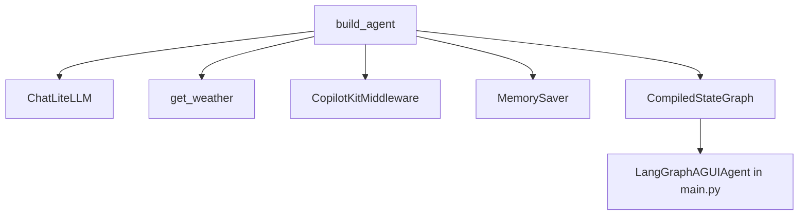

The agent graph is the backend heart of this starter. It is built in `backend/src/agent/utils.py` by `build_agent()`, which returns a `CompiledStateGraph`. Every user message eventually passes through this object before the frontend sees a tool call or final response.

## What It Is

`build_agent()` wraps a call to `create_deep_agent(...)` with five inputs:

- `model=model`
- `tools=[get_weather]`
- `middleware=[CopilotKitMiddleware()]`
- `system_prompt="You are a helpful assistant"`
- `checkpointer=MemorySaver()`

This matters because the repo does not use a separate builder class, config file, or dependency injection container. The graph is declared directly in code. If you want to change backend behavior, this is where you start.

## Why It Exists

Deep Agents gives you a higher-level graph abstraction over raw prompt calls. The graph can decide when to call a tool, preserve state through the checkpointer, and stream events outward to the CopilotKit bridge. Without this layer, you would need to manually coordinate model invocations, tool execution, and state persistence.

## How It Relates to Other Concepts

- It depends on the `get_weather` tool for concrete side effects and structured data.
- It depends on `CopilotKitMiddleware()` so the frontend can receive tool state in a form CopilotKit understands.
- It is wrapped by `LangGraphAGUIAgent` in `backend/src/agent/main.py` so FastAPI can expose it.
- It is consumed indirectly by the frontend through `LangGraphHttpAgent` in `frontend/src/app/api/copilotkit/route.ts`.



## How It Works Internally

At the top of `backend/src/agent/utils.py`, the module creates a model instance:

```python
model = ChatLiteLLM(model="github_copilot/gpt-5-mini")
```

That line is important for two reasons. First, model creation happens at import time, not inside `build_agent()`. Second, the choice of provider string is hard-coded. If the environment cannot authenticate GitHub Copilot-backed LiteLLM requests, graph construction will still succeed, but invocation will fail later when the model is used.

`get_weather(city: str) -> str` then returns a JSON string with six keys: `location`, `temperature`, `unit`, `weather`, `humidity`, and `windSpeed`. `build_agent()` injects that tool into the graph as the only available action. Because there is a `MemorySaver()` checkpointer, the direct invocation example in the module’s `__main__` block must pass:

```python
config = {"configurable": {"thread_id": "test-session-1"}}
```

That is not optional. LangGraph checkpointers need a thread identifier to scope state correctly.

## Basic Usage

This is the smallest backend-only example that mirrors the existing source:

```python
from agent.utils import build_agent

agent_graph = build_agent()
config = {"configurable": {"thread_id": "demo-thread"}}

result = agent_graph.invoke(
    {"messages": [{"role": "user", "content": "what is the weather in sf"}]},
    config=config,
)

print(result["messages"][-1].content)
```

Use this when you want to validate the graph independently from FastAPI or Next.js.

## Advanced Usage

A realistic extension is adding a second tool while keeping the CopilotKit middleware intact:

```python
import json

from copilotkit import CopilotKitMiddleware
from deepagents import create_deep_agent
from langchain_litellm import ChatLiteLLM
from langgraph.checkpoint.memory import MemorySaver


def get_weather(city: str) -> str:
    return json.dumps({"location": city, "temperature": 72, "unit": "F"})


def get_forecast(city: str, days: int = 3) -> str:
    return json.dumps(
        {
            "location": city,
            "days": days,
            "forecast": ["sunny", "cloudy", "rain"],
        }
    )


agent_graph = create_deep_agent(
    model=ChatLiteLLM(model="github_copilot/gpt-5-mini"),
    tools=[get_weather, get_forecast],
    middleware=[CopilotKitMiddleware()],
    system_prompt="You are a helpful assistant",
    checkpointer=MemorySaver(),
)
```

If you add a tool like this, you should also add a frontend `useRenderToolCall({ name: "get_forecast", ... })` renderer. Otherwise the UI will fall back to the generic `<details>` block.

<Callout type="warn">Because `MemorySaver` is configured in `build_agent()`, every direct graph invocation needs a `configurable.thread_id`. If you forget it, stateful runs can fail or behave inconsistently once you move beyond the simplest local experiments.</Callout>

<Accordions>
<Accordion title="Why use a module-level model instance?">
The current code creates `ChatLiteLLM` once at module import time. That keeps `build_agent()` short and avoids recreating the model every time the backend starts wiring a graph. The trade-off is reduced configurability. If you want per-environment model selection, lazy initialization, or easier dependency injection in tests, moving model construction inside `build_agent()` or into a separate factory function is a cleaner design. For example, a factory could read an environment variable and choose between `github_copilot/gpt-5-mini` and another LiteLLM-compatible model at runtime.
</Accordion>
<Accordion title="Why return JSON strings from tools instead of Python dicts?">
The frontend renderer in `frontend/src/app/page.tsx` is explicitly written to handle string results first by calling `JSON.parse(result)`. Returning a JSON string guarantees that the transport format is stable across the HTTP boundary and that the page can reconstruct the expected fields. The trade-off is that schema validation is deferred until the frontend parses the result, so errors appear later and are easier to miss. If you expand this project, introduce a shared schema or a stricter serialization layer before the graph sends tool data downstream.
</Accordion>
</Accordions>

The practical takeaway is simple: treat `build_agent()` as the composition root of the backend. Most meaningful backend changes belong there first.
