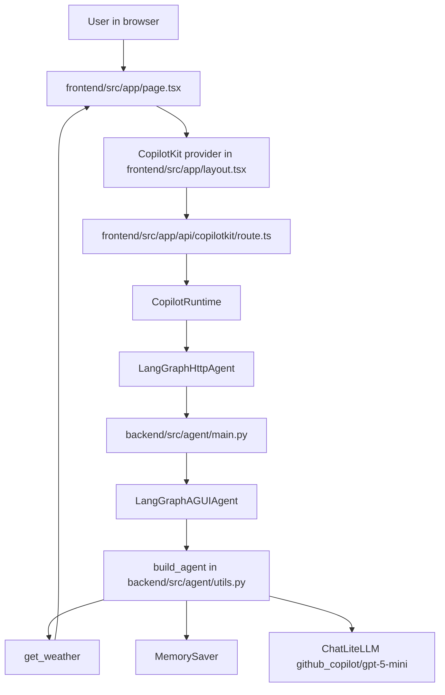
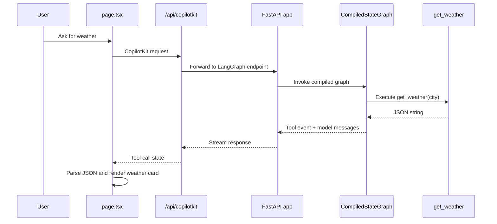
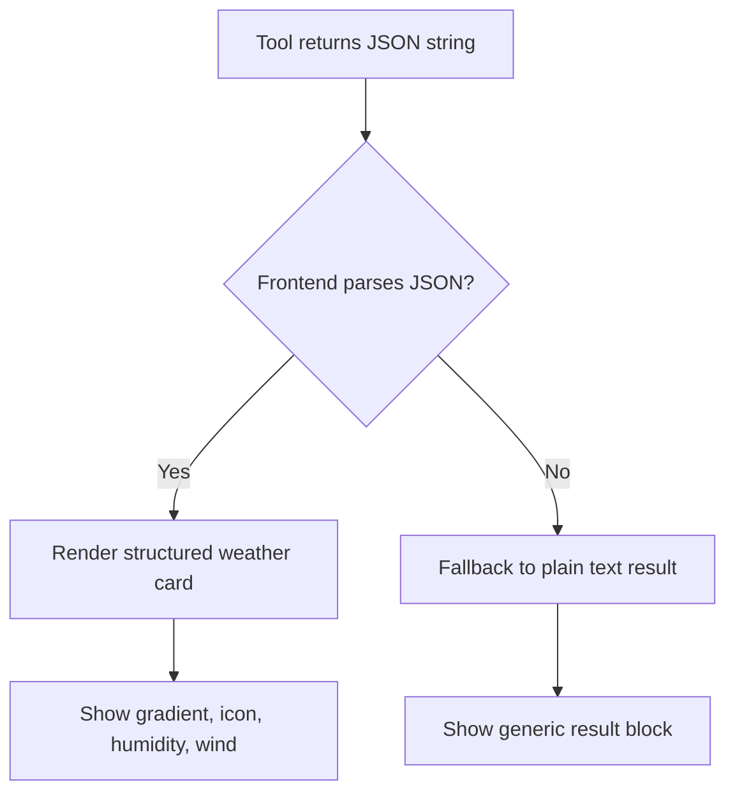

The repository is organized as two deployable applications joined by a very small contract. The backend owns agent orchestration and tool execution. The frontend owns request forwarding and rendering. That split is visible directly in `backend/src/agent/main.py`, `backend/src/agent/utils.py`, `frontend/src/app/api/copilotkit/route.ts`, and `frontend/src/app/page.tsx`.

## Module Relationships

The backend starts in `backend/src/agent/main.py`. It loads environment variables, constructs a FastAPI app, calls `build_agent()`, and registers the graph with `add_langgraph_fastapi_endpoint`. That file is intentionally thin. Most domain logic lives in `backend/src/agent/utils.py`, where the module-level `model` is created, the `get_weather` tool is defined, and `create_deep_agent(...)` compiles the graph.

The frontend follows the same separation. `frontend/src/app/layout.tsx` wraps the app with `<CopilotKit runtimeUrl="/api/copilotkit" agent="weather_assistant">`. `frontend/src/app/api/copilotkit/route.ts` instantiates a `CopilotRuntime` with a single `LangGraphHttpAgent`, pointing at `process.env.LANGGRAPH_DEPLOYMENT_URL || "http://localhost:8123"`. `frontend/src/app/page.tsx` is purely about presentation. It registers a generic fallback renderer with `useDefaultTool(...)` and a specialized renderer for the `get_weather` tool with `useRenderToolCall(...)`.

## Request Lifecycle

The most important design choice is that the tool result is serialized as JSON text, not as a Python object. `get_weather(city: str) -> str` returns `json.dumps(weather_data)` because CopilotKit tool rendering in the page assumes it may receive a string result and attempts `JSON.parse(result)` before falling back to raw text. That constraint is encoded on both sides of the boundary: `backend/src/agent/utils.py` linearly serializes, and `frontend/src/app/page.tsx` defensively parses.

## Key Design Decisions

### Thin transport layer

`backend/src/agent/main.py` does not contain conversation logic. It creates the app, registers the graph, and exposes `/healthz`. That keeps the HTTP surface stable while letting you evolve the graph independently in `utils.py`. It also makes the backend easier to test in isolation because the orchestration logic is not tangled with route definitions.

### Graph construction in one function

`build_agent()` centralizes the call to `create_deep_agent(...)`. The graph gets the model, tool list, middleware list, system prompt, and checkpointer in one place. That is the real extension point in this starter. If you add more tools, swap the model, or change middleware, this file is where the architecture changes.

### Frontend-specific tool rendering

The page contains both `useDefaultTool` and `useRenderToolCall`. That combination matters. Unknown tool calls still render through the generic `
` fallback, while the weather tool gets a dedicated visual component. This is the practical pattern for growing an agent UI: preserve a generic renderer so new tools remain debuggable while you selectively invest in richer UI for high-value tools.

### Environment-based service discovery

The frontend route defaults to `http://localhost:8123`, but the Kubernetes deployment injects `LANGGRAPH_DEPLOYMENT_URL=http://backend:8123`. That keeps local development and in-cluster networking aligned without changing code. `skaffold.yaml` and `frontend/k8s/deployment.yaml` prove that the project expects service discovery through environment variables rather than static imports or shared config files.

## How the Pieces Fit Together

The overall structure is a bridge architecture:

- LangGraph and Deep Agents own planning, memory, and tool invocation.
- FastAPI and `LangGraphAGUIAgent` expose that graph over HTTP.
- CopilotKit runtime converts browser requests into backend calls.
- React hooks convert streamed tool events into UI fragments.

That split is deliberate because each layer solves a separate problem. The backend decides what to do. The frontend decides how to show it. The runtime and AGUI wrapper are the protocol boundary between those two concerns.

That last fallback path is easy to miss, but it is important. The page is built to survive incomplete or malformed tool results. The app can still render something useful if a future tool returns plain text instead of structured JSON.
