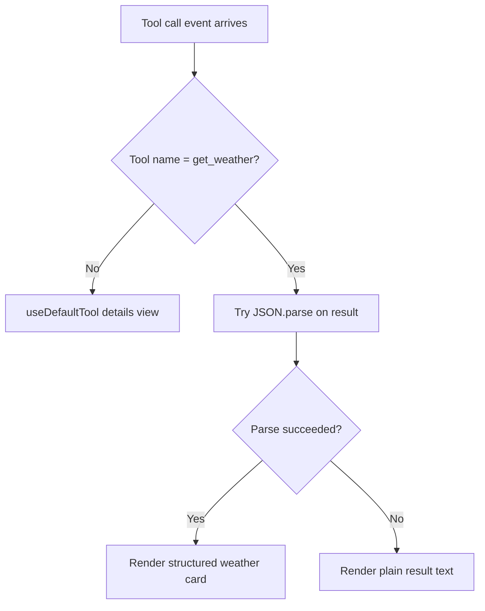

The generative UI layer lives in `frontend/src/app/page.tsx`. It is where CopilotKit tool events stop being backend data and start becoming user-visible interface. The file registers two renderers: a generic default renderer for unknown tools and a specialized renderer for the `get_weather` tool.

## What It Is

`useDefaultTool(...)` provides a fallback `<details>` block that shows the tool name, status, args, and result. `useRenderToolCall(...)` intercepts the `get_weather` tool specifically and replaces that generic output with a weather card.

This split is the central frontend idea in the starter. The UI does not render agent messages only. It also renders tool execution states directly.

## Why It Exists

A plain chat bubble is often the wrong UI for structured data. Weather results have known fields such as location, temperature, humidity, and wind speed. The page uses those fields to produce a richer component with icons, gradients, and status indicators. That makes tool calls feel like application features instead of debug text.

## How It Relates to Other Concepts

- It relies on `get_weather` returning a JSON string from `backend/src/agent/utils.py`.
- It receives tool events from the CopilotKit provider in `frontend/src/app/layout.tsx`.
- It depends on the runtime bridge in `frontend/src/app/api/copilotkit/route.ts` to forward requests to the backend.



## How It Works Internally

The `render` callback inside `useRenderToolCall(...)` follows a three-step flow:

1. Try to parse `result` when it is a string.
2. Infer a display condition from `weatherData?.weather || result || 'sunny'`.
3. Render either a loading state, a structured card, or a plain text fallback.

Two helper functions are nested inside the renderer:

- `getWeatherIcon(condition: string)` maps textual conditions to emoji.
- `getWeatherGradient(condition: string)` maps textual conditions to Tailwind gradient classes.

Because both helpers are inside the render callback, they are tightly scoped to the weather tool and are not reused elsewhere. That is fine for a starter project with one specialized tool renderer.

## Basic Usage

This is the simplest useful pattern from the page:

```tsx
useRenderToolCall({
  name: "get_weather",
  render: ({ status, result }) => {
    const weatherData =
      result && typeof result === "string" ? JSON.parse(result) : result;

    if (status !== "complete") {
      return <p>Fetching weather...</p>;
    }

    return (
      <div>
        <h3>{weatherData.location}</h3>
        <p>
          {weatherData.temperature}°{weatherData.unit}
        </p>
      </div>
    );
  },
});
```

That is enough to turn a structured tool response into app-specific UI.

## Advanced Usage

The file already includes a useful edge-case pattern: graceful fallback when the result is not valid JSON.

```tsx
useRenderToolCall({
  name: "get_weather",
  render: ({ status, result }) => {
    let weatherData = null;

    try {
      weatherData =
        result && typeof result === "string" ? JSON.parse(result) : result;
    } catch (error) {
      weatherData = null;
    }

    if (status === "complete" && !weatherData && result) {
      return <p>{result}</p>;
    }

    return null;
  },
});
```

That fallback is important when you are incrementally migrating tools from plain text outputs to structured outputs. The UI remains usable while the backend contract evolves.

<Callout type="warn">The card only shows humidity and wind speed when those values are truthy. In the current JSX, `0` would be treated as missing because the code checks `weatherData.humidity` and `weatherData.windSpeed` directly. If you add tools that can return zero-like values, switch those conditions to explicit null checks.</Callout>

<Accordions>
<Accordion title="Why keep the generic default renderer when a custom weather renderer already exists?">
The default renderer gives you immediate observability for every tool call, even before you design custom UI for that tool. That is especially useful while the agent surface is still changing because it prevents new tools from disappearing silently in the interface. The trade-off is duplication. A tool with a specialized renderer still has a generic representation pattern nearby, which can feel redundant, but the debugging value is worth it in an evolving agent app.
</Accordion>
<Accordion title="Why parse tool output on the client instead of enforcing a strict schema earlier?">
Client-side parsing makes the starter flexible and easy to understand because the page can accept either a JSON string or a plain object and still render. That lowers the barrier to experimentation when you are wiring tools for the first time. The trade-off is weaker guarantees. If a backend tool changes shape unexpectedly, the failure shifts into UI code, so you should move toward shared schemas or typed contracts once the prototype becomes a maintained product.
</Accordion>
</Accordions>

The key idea is not the weather card itself. The key idea is that tool calls can be rendered as first-class UI components, which is the pattern you reuse when you add richer agent behaviors.
