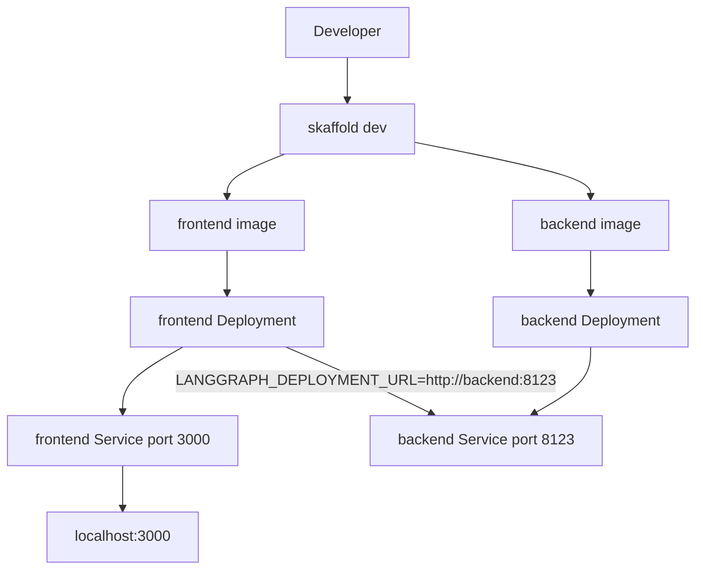

The repo includes a minimal Kubernetes path for both services. `skaffold.yaml` builds the frontend and backend images, deploys the manifests in `frontend/k8s/deployment.yaml` and `backend/k8s/deployment.yaml`, and port-forwards the frontend service to `localhost:3000`.

<Steps>
<Step>
### Review the build graph

The Skaffold config defines two artifacts:

```yaml
build:
  artifacts:
    - image: frontend
      context: ./frontend
      sync:
        infer:
          - "**/*.ts"
          - "**/*.tsx"
          - "**/*.css"
    - image: backend
      context: ./backend
      sync:
        infer:
          - "**/*.py"
```

That means ordinary TypeScript, CSS, and Python changes can be live-synced without a full image rebuild.
</Step>
<Step>
### Start the cluster workflow

```bash
cd /workspace/home/agent-studio-starter
skaffold dev
```

Skaffold will build both images, apply both manifest files, and set up port forwarding for the frontend service.
</Step>
<Step>
### Verify in-cluster service discovery

The frontend deployment injects:

```yaml
env:
  - name: LANGGRAPH_DEPLOYMENT_URL
    value: "http://backend:8123"
```

That matches the backend service name declared in `backend/k8s/deployment.yaml`.
</Step>
<Step>
### Open the application

Visit:

```text
http://localhost:3000
```

The browser still talks to `/api/copilotkit`, but now the route forwards to the backend service inside the cluster.
</Step>
</Steps>

## Deployment Topology



## Why This Setup Works

The frontend never needs a hard-coded cluster DNS name in source code because the environment variable is injected at deployment time. The backend does not need ingress or a public URL for local development because the browser only reaches the frontend service through port forwarding. That keeps the cluster setup minimal while still exercising the same route and provider logic used in local development.

## Practical Notes

- Only the frontend service is port-forwarded by default in `skaffold.yaml`.
- The backend service uses `clusterIP: None`, which is enough for internal service discovery in this simple setup.
- Both deployments are single replica manifests. This starter is optimized for iteration speed, not production hardening.

Use this path when you want to test the same multi-service topology you intend to keep in deployment, but without building a full production platform first.
